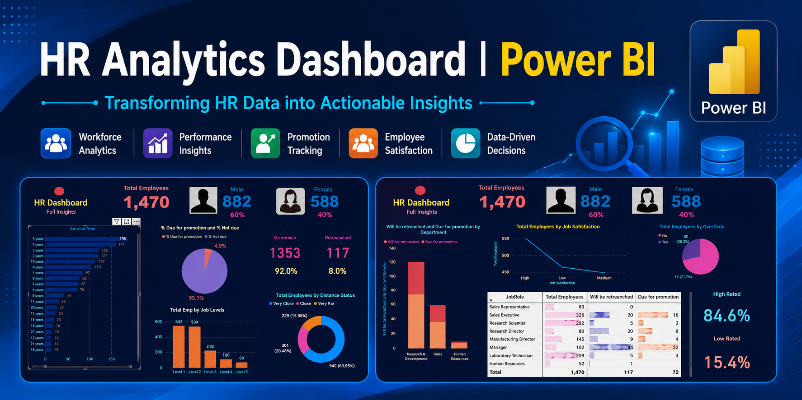
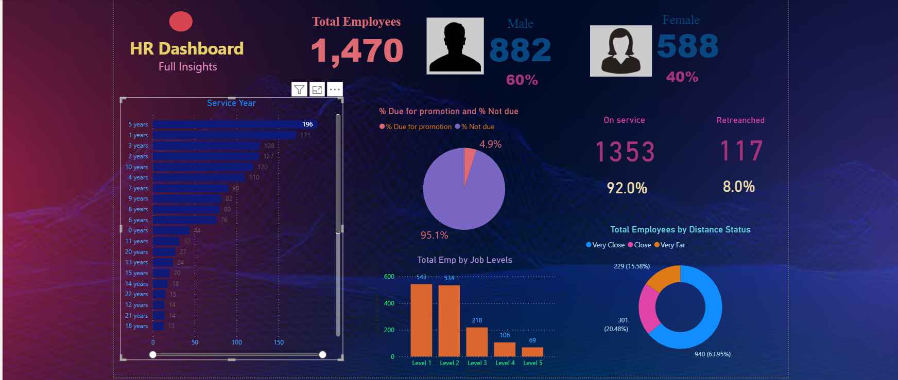
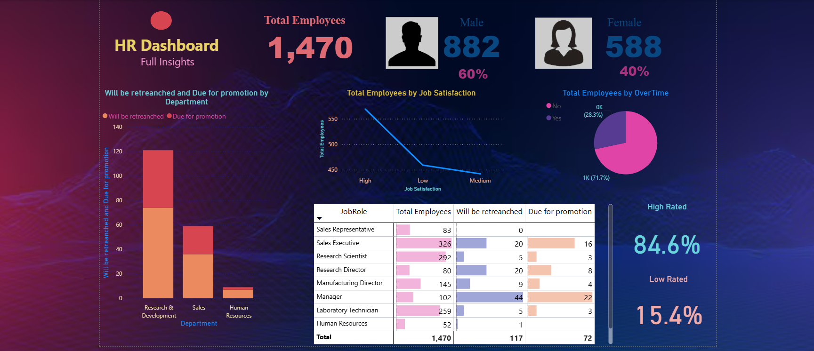

<div align="center">



# 📊 HR Analytics Dashboard using Power BI

### Transforming HR Data into Actionable Business Insights

<p>


</p>


</div>

---

# 📌 Project Overview

The **HR Analytics Dashboard** is a professional Business Intelligence solution developed using **Microsoft Power BI** to transform raw HR data into meaningful business insights.

The dashboard enables HR professionals and business leaders to monitor workforce performance, employee demographics, promotions, retrenchment trends, job satisfaction, and organizational KPIs through interactive visualizations.

---

# 🎯 Project Objectives

- Analyze workforce demographics
- Track employee promotions
- Monitor retrenchment trends
- Evaluate employee satisfaction
- Identify workforce distribution
- Improve HR decision-making through interactive dashboards

---

# 🚀 Dashboard Features

### 👥 Workforce Analytics

- Employee Demographics
- Gender Distribution
- Service Year Analysis
- Distance Status Analysis
- Job Level Distribution

### 📈 Employee Performance

- Job Satisfaction
- Promotion Eligibility
- Retrenchment Analysis
- Employee Ratings
- Department Analysis

### 📊 Business Intelligence

- KPI Cards
- Interactive Filters
- Dynamic Reports
- Drill-down Analysis
- Executive Dashboard

---

# 🛠 Technologies Used

| Technology         | Purpose                        |
| ------------------ | ------------------------------ |
| Microsoft Power BI | Dashboard Development          |
| DAX                | Business Calculations          |
| Power Query        | Data Cleaning & Transformation |
| Data Modeling      | Relationship Management        |
| Excel / CSV        | Data Source                    |

---

# 🖼 Dashboard Preview

<table>

<tr>

<td width="50%">

<h3 align="center">🏠 Home Dashboard</h3>



</td>

<td width="50%">

<h3 align="center">📊 Action Dashboard</h3>



</td>

</tr>

</table>

---

# 📈 Key Performance Indicators

- 👨 Total Employees
- 👨 Male Employees
- 👩 Female Employees
- 📈 Promotion Eligibility
- 📉 Retrenchment Analysis
- 😊 Job Satisfaction
- 🏢 Department Insights
- 📍 Employee Distance Analysis
- 📊 Job Level Distribution

---

# 📊 Dashboard Insights

## 🏠 Home Dashboard

✔ Workforce Overview

✔ Gender Distribution

✔ Promotion Status

✔ Employee Distance Analysis

✔ Service Year Distribution

✔ Job Level Analysis

---

## 📊 Action Dashboard

✔ Department Performance

✔ Promotion by Department

✔ Retrenchment Analysis

✔ Employee Satisfaction

✔ Job Role Analysis

✔ Employee Rating

✔ Overtime Analysis

---

# 💼 Business Impact

This dashboard helps organizations:

- Reduce manual HR reporting using interactive dashboards.
- Improve workforce visibility with centralized KPIs.
- Support data-driven HR decision-making.
- Monitor promotion eligibility and retrenchment trends.
- Analyze employee satisfaction across departments.
- Enable faster business insights using dynamic filtering and visualization.

---

# 💡 Skills Demonstrated

- Microsoft Power BI
- Dashboard Development
- Business Intelligence
- Data Visualization
- Data Cleaning
- Power Query
- DAX
- Data Modeling
- KPI Reporting
- HR Analytics
- Analytical Thinking
- Problem Solving

---

# 📂 Repository Structure

```
HR-Analytics-Dashboard
│
├── README.md
├── LICENSE
├── HR_Analytics_Dashboard.pbix
│
├── assets
│   ├── banner.png
│   ├── dashboard-home.png
│   └── dashboard-action.png

```

---

# 🚀 Future Enhancements

- Azure SQL Integration
- Power BI Service Deployment
- Row-Level Security (RLS)
- Automated Data Refresh
- Predictive HR Analytics using Machine Learning
- Employee Attrition Prediction
- Azure Data Factory Integration
- Cloud-Based Reporting

---

# 📚 Learning Outcomes

Through this project, I gained hands-on experience in:

- Interactive Dashboard Development
- Business Intelligence Reporting
- Data Cleaning & Transformation
- Data Modeling
- DAX Calculations
- KPI Design
- Data Storytelling
- HR Analytics
- Decision Support Systems

---

# 📷 Dashboard Screenshots

## 🏠 Home Dashboard


---

## 📊 Action Dashboard


---

# ⭐ Why This Project?

Organizations generate large volumes of HR data every day, but extracting meaningful insights from that data can be challenging. This dashboard demonstrates how Business Intelligence can simplify workforce analysis through interactive visualizations, helping HR teams make informed decisions faster.

---

# 👨‍💻 Author

## Pranai Teja Sabbe

📍 Germany

📧 Email: **pranaitejasabbe7@gmail.com**

💼 LinkedIn: **https://linkedin.com/in/sabbe-pranai-teja**

💻 GitHub: **https://github.com/pranai-777**

---

<div align="center">

## ⭐ If you found this project helpful, please consider giving it a Star!

### Made with ❤️ using Microsoft Power BI

</div>
